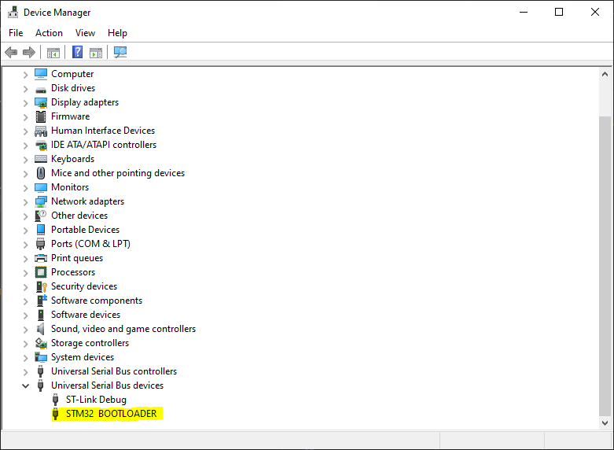
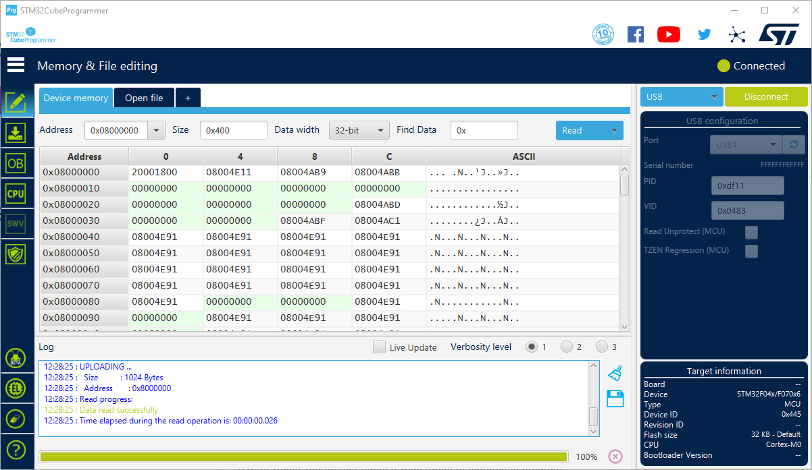
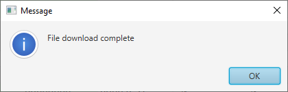
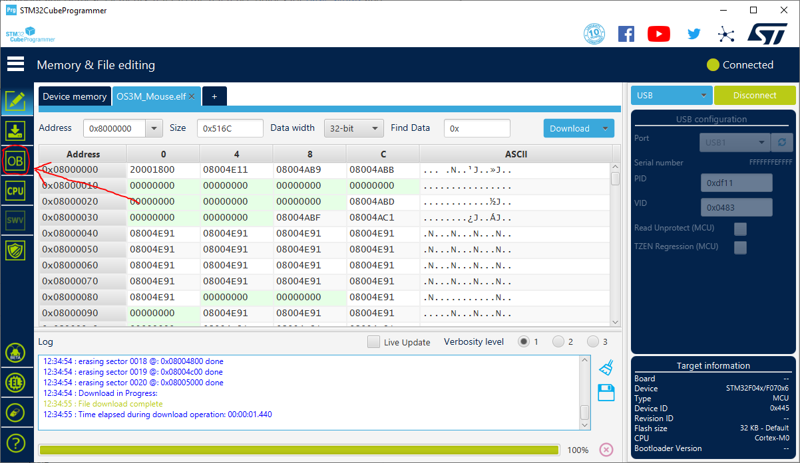
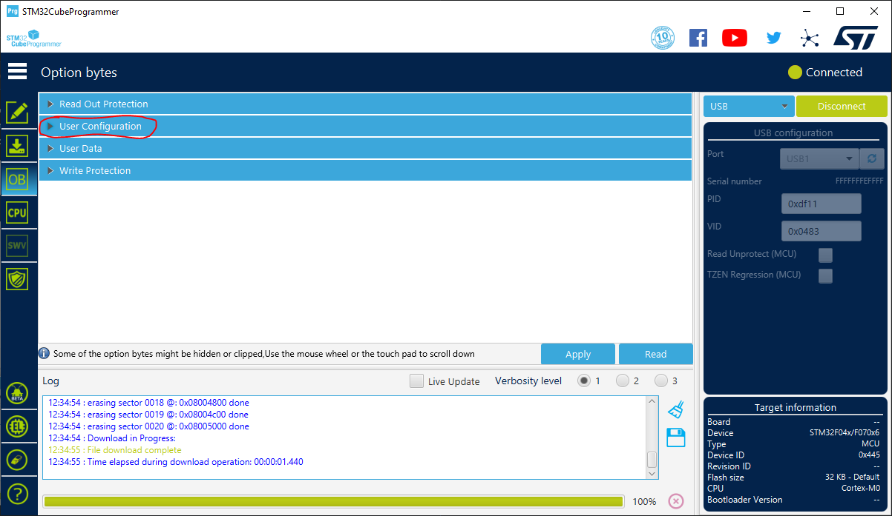
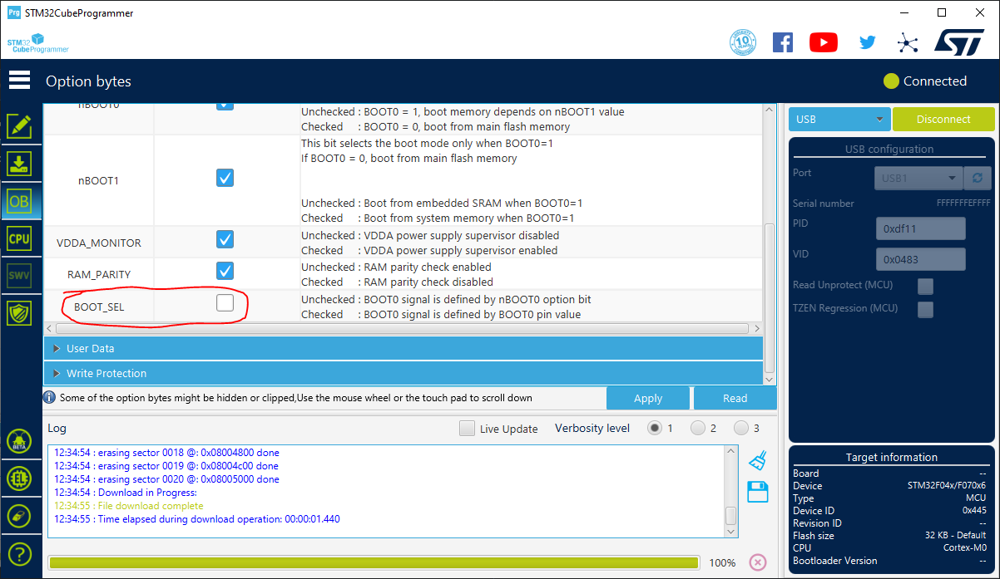
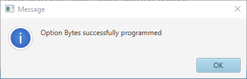
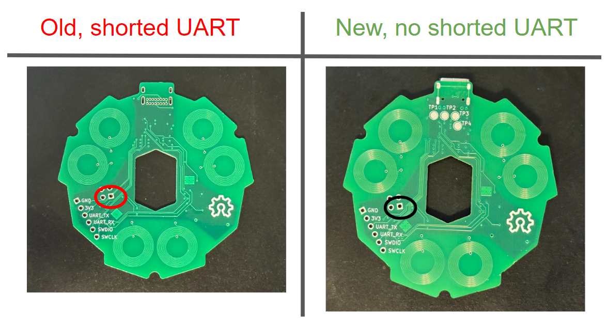
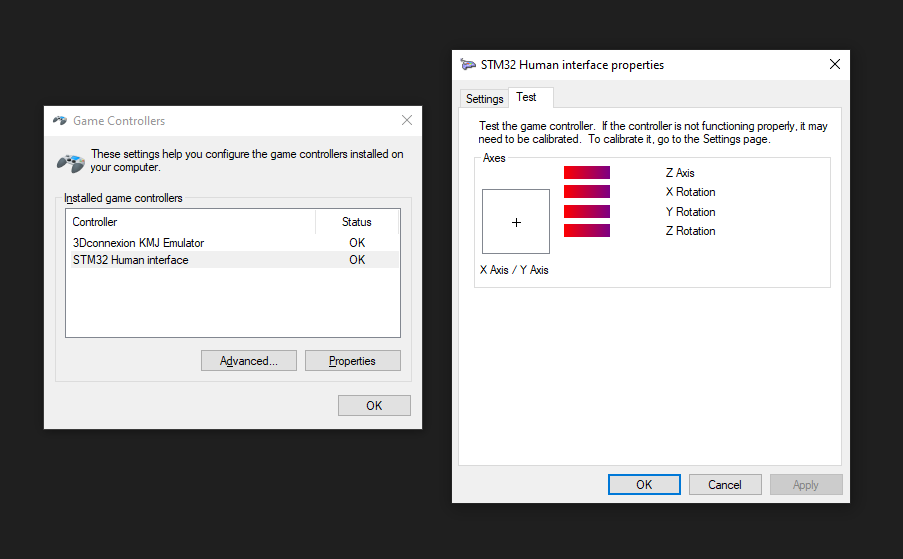

# How to flash the OS3M Mouse

Congratulations on building or buying your own OS3M mouse! In this guide, I'm going to be instructing you on how to flash your new mouse with the latest firmware. The process is straightforward, but there are a couple pitfalls to be aware of, especially if you have an earlier revision of the board.
## Step 1: Acquiring Requisite Software
To flash your mouse, you need 2 things: 
- STM32CubeProgrammer, available [here.](https://www.st.com/en/development-tools/stm32cubeprog.html) Install as you would any other program.
- The latest firmware, available on the releases page

## Step 2: Connecting Your Board
Plug in the type-C connector of your mouse into your PC, if you're on Windows, you should see the STM32 Bootloader show up in device manager, like this:

## Step 3: Flashing the Firmware
Open up STM32CubeProgrammer. It should look like this:

In the top right, there is a dropdown menu, and in my image you can see "USB" is selected. If you have an ST-Link, there is also an option for that. For most people, USB should be sufficient. Click "Connect", and the software should connect to the bootloader and read off all the flash memory. It should look like this, though you may have different contents in flash since I have already flashed my board:

After this, select the "Open file" tab at the top, right beside "Device memory". A dialog should pop up, prompting you to select a file to flash the STM32 with. Select "OS3M_Mouse.elf". The binary contents of the file should show up in the GUI, like so:

Click "Download" in the top right, you should see the software writing out the binary into flash memory, and when complete, you should see this dialog pop up:

**IF YOU STOP HERE, AT BEST YOU WILL NOT BE ABLE TO FLASH THE BOARD THROUGH USB, AT WORST YOUR BOARD WILL NOT BOOT**

**YOU MUST ALSO CHANGE THE OPTION BYTES TO PROPERLY ALLOW RE-ENTRY INTO THE BOOTLOADER, AND STOP THE BOARD FROM BOOTLOOPING**

## Step 4: Setting the Option Bytes

To set the appropriate option bytes, click the "OB" symbol on the left, like so:

Select "User Configuration":

Scroll down, the uncheck the "BOOT_SEL" box:

Click "Apply", the option bytes should be loaded and you should get a dialog like this:

Your board is now good to go!

## Addendum A: How to re-flash your board once you've already programmed it

The only thing you need to do once you're flashed your board and want to update the software is to short the UART_TX and UART_RX pins. This should place the board back into bootloader mode and you can perform step 3 (you should only need to reflash, not set the option bytes again) to get the new software onto the board. 

Note, this does not work on earlier revisions of the board where I accidentally shorted UART_TX and UART_RX to the +3.3V bus. I am sorry. The only way to reprogram these is to use an ST-Link. You can tell if you have one of these boards by looking here:

## Addendum B: How to check your board works

A simple way to check if your board is working (on Windows 10) is by searching "Set up USB game controllers" in windows, opening that window, then double clicking STM32 Human Interface (someday I should change this to be OS3M Mouse, oh well). You should see the layout on the right that shows all axes of the mouse. These axes should move when you move the mouse.

